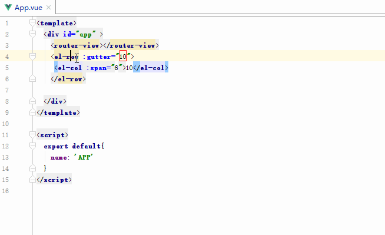
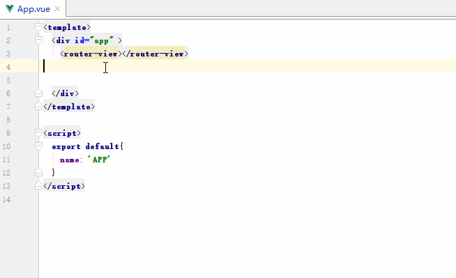
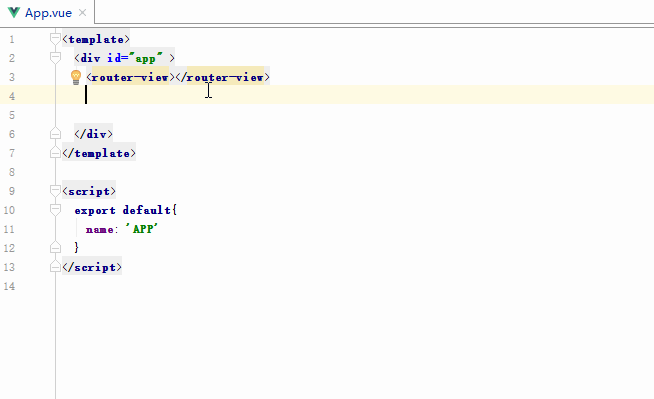
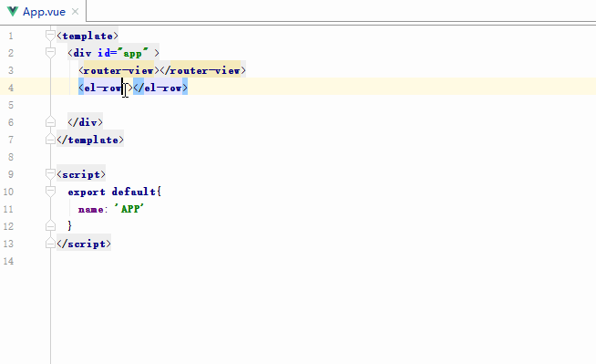
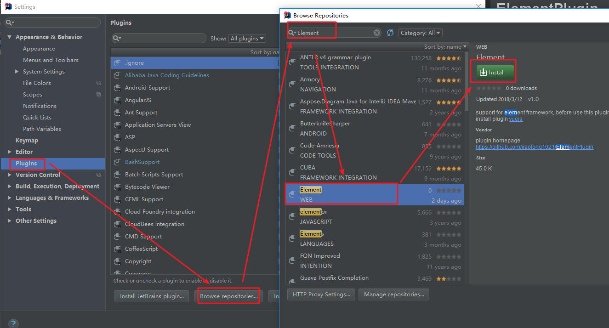

# ElementPlugin
idea plugin for develop with element ui. before use, you must install <a href="https://github.com/JetBrains/intellij-plugins/tree/master/vuejs">vuejs</a> plugin.
## basic functions
### 1 . see tag document (ctrl + Q)

### 2. live templates (ctrl + space)

### 3. edit through tag name

### 4. tag property tip

## download
if you use webstorm or IntelliJ IDEA, you can download from plugin repositories.

or you can direct download from <a href="https://plugins.jetbrains.com/plugin/10524-element">jetbrains plugins repository</a> 